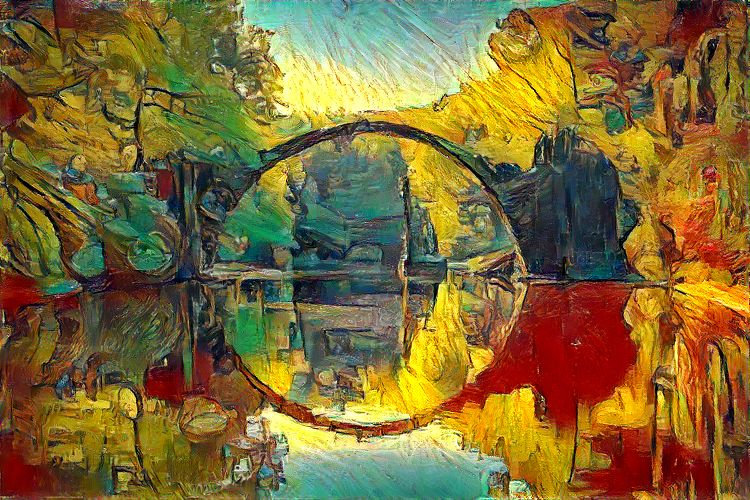
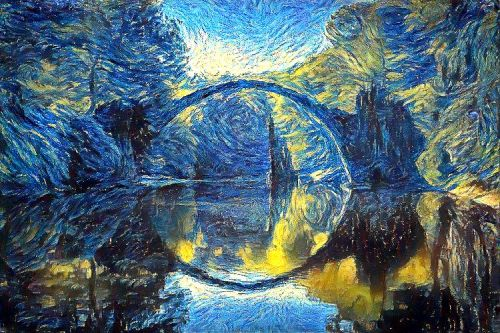
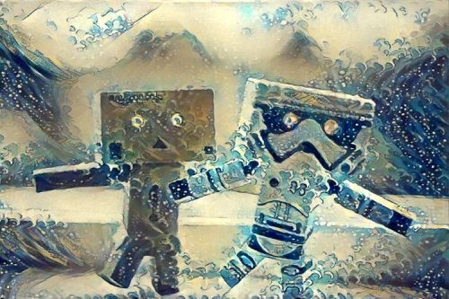
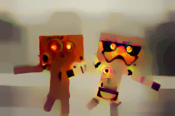
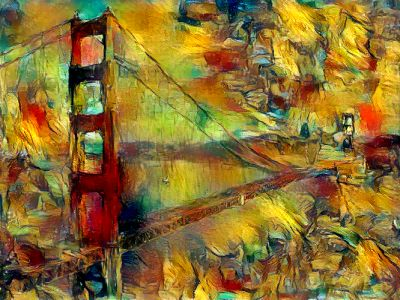
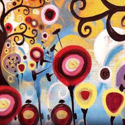

This repo is my implementation of NST, following the paper and Aleksa Video and Repo (See the Citation).

## Neural Style Transfer (optimization method):
This repo contains a concise PyTorch implementation of the original NST paper (:link: [Gatys et al.](https://www.cv-foundation.org/openaccess/content_cvpr_2016/papers/Gatys_Image_Style_Transfer_CVPR_2016_paper.pdf)).


### What is NST algorithm?
The algorithm transfers style from one input image (the style image) onto another input image (the content image) using CNN nets (usually VGG-16/19) and gives a composite, stylized image out which keeps the content from the content image but takes the style from the style image.

<p align="center">


</p>


## Examples

Transfering style gives beautiful artistic results:

<p align="center">



</p>

And here are some results coupled with their style:

<p align="center">





</p>

*Note: all of the stylized images were produced by me (using this repo), credits for original image artists [are given bellow](#acknowledgements).*

### Content/Style tradeoff

Changing style weight gives you less or more style on the final image, assuming you keep the content weight constant. <br/>
I did increments of 10 here for style weight (1e1, 1e2, 1e3, 1e4), while keeping content weight at constant 1e5, and I used random image as initialization image. 

<p align="center">


</p>

### Impact of total variation (tv) loss

Rarely explained, the total variation loss i.e. it's corresponding weight controls the smoothness of the image. <br/>
I also did increments of 10 here (1e1, 1e4, 1e5, 1e6) and I used content image as initialization image.

<p align="center">



</p>

### Optimization initialization

Starting with different initialization images: noise (white or gaussian), content and style leads to different results. <br/>
Empirically content image gives the best results as explored in [this research paper](https://arxiv.org/pdf/1602.07188.pdf) also. <br/>
Here you can see results for content, random and style initialization in that order (left to right):

<p align="center">



</p>

You can also see that with style initialization we had some content from the artwork leaking directly into our output.

### Famous "Figure 3" reconstruction

Finally if I haven't included this portion you couldn't say that I've successfully reproduced the [original paper]((https://www.cv-foundation.org/openaccess/content_cvpr_2016/papers/Gatys_Image_Style_Transfer_CVPR_2016_paper.pdf)) (laughs in Python):

<p align="center">


</p>

I haven't give it much effort results can be much nicer.

### Content reconstruction

If we only use the content (perceptual) loss and try to minimize that objective function this is what we get (starting from noise):

<p align="center">


</p>

In steps 0, 26, 70 and 509 of the L-BFGS numerical optimizer, using layer relu3_1 for content representation.<br/> 
Check-out [this section](#reconstruct-image-from-representation) if you want to play with this.

### Style reconstruction

We can do the same thing for style (on the left is the original art image "Candy") starting from noise:

<p align="center">



</p>

In steps 45, 129 and 510 of the L-BFGS using layers relu1_1, relu2_1, relu3_1, relu4_1 and relu5_1 for style representation.

## Setup

1. Open Anaconda Prompt and navigate into project directory `cd path_to_repo`
2. Run `conda env create` (while in project directory)
3. Run `activate pytorch-nst`

That's it! It should work out-of-the-box executing environment.yml file which deals with dependencies.

-----

PyTorch package will pull some version of CUDA with it, but it is highly recommended that you install system-wide CUDA beforehand, mostly because of GPU drivers. I also recommend using Miniconda installer as a way to get conda on your system. 

Follow through points 1 and 2 of [this setup](https://github.com/Petlja/PSIML/blob/master/docs/MachineSetup.md) and use the most up-to-date versions of Miniconda (Python 3.7) and CUDA/cuDNN.
(I recommend CUDA 10.1 as it is compatible with PyTorch 1.4, which is used in this repo, and newest compatible cuDNN)

## Usage

1. Copy content images to the default content image directory: `/data/content-images/`
2. Copy style images to the default style image directory: `/data/style-images/`
3. Run `python neural_style_transfer.py --content_img_name <content-img-name> --style_img_name <style-img-name>`


## Citation

```
@misc{Gordić2020nst,
  author = {Gordić, Aleksa},
  title = {pytorch-neural-style-transfer},
  year = {2020},
  publisher = {GitHub},
  journal = {GitHub repository},
  howpublished = {\url{https://github.com/gordicaleksa/pytorch-neural-style-transfer}},
}
```
